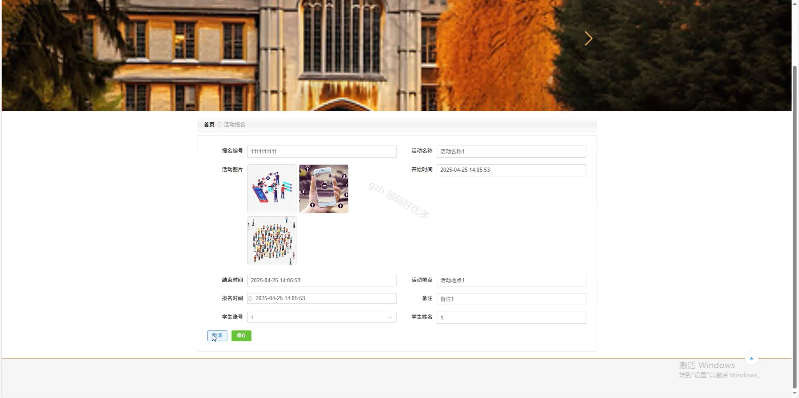
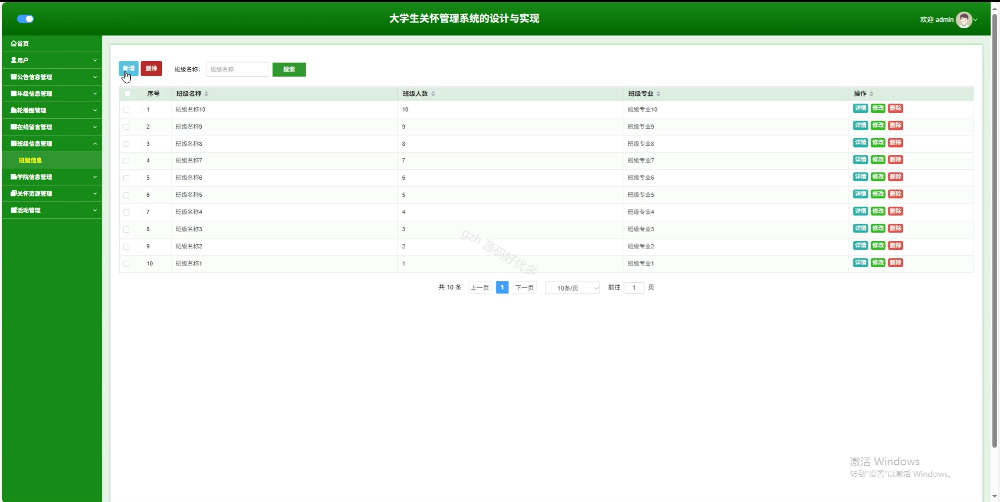

# springbootA284D
springbootA284D大学生关怀管理系统
 
## 查看主页获取源码

### 一、关键词
学校信息管理、关怀资源管理、活动管理

### 二、作品包含
源码+数据库+全套环境和工具资源+本地部署教程

### 三、项目技术
前端技术：Html、Css、Js、Vue3.0、Element-plus 
后端技术：Java、SpringBoot3.0、MyBatis

### 四、运行环境（以下版本亲测，其他版本未知，请自测）
开发工具：IDEA/eclipse  + VSCODE

数据库：MySQL5.7（最低要5.7版本）

数据库管理工具：Navicat10以上版本

环境配置软件： JDK17 + Maven3.6.3

前端Nodejs：20

浏览器：谷歌浏览器

### 五、项目介绍
项目编号：springbootA284D

大学生关怀管理系统用于整合学生信息等多方面关怀服务，助力学生健康成长。

角色：管理员、用户、教师

管理员功能：首页、用户、公告信息管理、年级信息管理、轮播图管理、在线留言管理、班级信息管理、学校信息管理、关怀资源管理、活动管理。

用户功能：首页、关怀资源、关怀活动信息、公告信息、咨询信息、个人中心、修改密码、聊天记录、教师、在线留言、活动报名、预约咨询、我的收藏。

教师功能：首页、用户、在线留言管理、公告信息管理、预约咨询管理、活动管理、关怀资源管理。

### 六、运行截图

